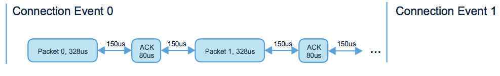

# Understanding & Optimizing BLE Throughput

This article highlights the factors which control BLE throughput when using GATT. If you are trying to improve the throughput of your BLE application or just want to understand more about the protocol in general, please read on!

# Terminology

Before we get started there's a few basic pieces of terminology that are useful to know.

* **Connection Event** - For BLE, *exactly* two devices are talking with each other in one *connection*. Even if data is not being exchanged, each side must ping each other periodically to ensure the *connection* is still alive. Each time the devices ping one another is known as a *Connection Event*

* **Connection Interval** - The time between each *Connection Event* (valid range is 7.5ms to 4 seconds). The *Connection Interval* can be negotiated once the two devices are connected. To optimize for power, it is often favorable to change the *Connection Interval*

# Understanding The LE Packet Layers

To optimize throughput, it is first important to look at how Bluetooth LE packets are constructed

## Bluetooth Baseband / Radio

The BLE Radio is capable of transmitting 1 symbol per μs (giving it a bitrate of 1Mbit/second). This is **not** the throughput which will be observed for several reasons:

1. There is a mandatory *150μs* delay that must be between each packet sent (known as the *Inter Frame Space (T_IFS)*)
2. BLE is a *reliable transport* meaning every packet of data sent from one side must be acknowledged (ACK'd) by the other. The size of an ACK is *80bits* and thus takes *80μs* to transmit.
3. The typical data packet is 41 bytes (*328 bits*) and thus takes 328μs to transmit.

### An example data exchange

# The Link Layer (LL) Packet

This is the format used for data sent over the air. All the higher level messages are constructed from the *Data Payload* of the LL Packet

## Maximum LL Data Payload throughput

The exchange of one packet of data involves:

* Side A sends a maximum size data LL packet
* Side B receieves the packet and waits T_IFS
* Side B sends an ACK
* Side A waits T_IFS and then can stop sending or transmit more data

Based on the discussion above, the time this sequence takes can be computed:

`328μs data packet + 150μs T_IFS + 80μs ACK + 150μs T_IFS = 708μs`

During this time period, 27 bytes of actual data can be transmitted which takes 216μs.

This yields a data throughput of:

`(216μs / 708μs) * 1Mbit/sec = 305,084 bits/second = 38.1kB/s`

# L2CAP Channels & Payloads

L2CAP is the higher level protocol packed inside the **Data Payloads** of the LL packets. L2CAP allows:

* unrelated data flows to be multiplexed across different *channels* 
* fragmenting and de-fragmenting data across multiple LL Packets 

There are only a few different L2CAP channels used for LE:

1. **Security Manager protocol (SMP)** - for BLE security setup
2. **Attribute protocol (ATT)** - Android & iOS both offer APIs that allow 3rd party apps to control transfers over this channel. 
3. **LE L2CAP Connection Oriented Channel** - Custom channels which could be very advantageous over ATT for streaming applications. However, there are not 3rd party APIs for this on mobile platforms today so it's not very useful yet.

### The L2CAP Packet

# Attribute Protocol (ATT) Packet

In the *L2CAP Information Payload* we have the ATT packet. This is the packet structure the *GATT* protocol which BLE devices typically use to exchange data over. The packet looks like this:

## Maximum throughput over GATT

The Attribute Protocol *Handle Value Notification* is the best way for a server to stream data to a client. The *Opcode Overhead* for this operation is 2 bytes. That means there is 3 bytes of ATT packet overhead and 4 bytes of L2CAP overhead for each ATT payload. We can use this information to calculate the ATT throughput as:

`ATT Throughput = LL throughput * ((MTU Size - ATT Overhead) / (L2CAP overhead + MTU Size))`

### Max throughput achievable by ATT MTU size
MTU size (bytes)         | Throughput (kBytes/sec) |
-------------            | -------------           |
23 (default)             |  28.2                   |
185 (iOS 10 max)         |  36.7                   |
512 (max)                |  37.6                   |

## Realistic throughput over GATT

In practice, the achievable throughput rates are further restricted by the devices being used. Some common limiting factors are:

* The number of packets which can be transmitted in one *connection event*. An entire *connection event* could be filled with data but many devices will only transmit several packets per event.
* For devices which will only send a few packets per *connection event*, it then becomes important to try and make the *connection interval* very short so data can be sent often. However, devices will often only support a portion of the 7.5ms - 4s range.
* Max MTU size supported by the device
* BT LE, BT Classic & Wifi share the same antenna / chip / scheduler and so bursts of wifi/classic traffic can reduce how many packets of LE data will be sent per *connection event*

Below I'll walk through two phones and their peak *GATT* throughput. Do note that often a developer will add another protocol on top of *GATT* to stream data. The scheme chosen can also have a significant impact on the throughput. 

### Example 1 - iOS 10 / iPhoneSE

#### Background
For iOS < 10, ~4-6 packets are transmitted per connection interval and the max MTU size supported is 158 bytes. For iOS 10, many iPhones now support 185 byte MTU and 7 packets per connection interval.

When you connect to a BLE device with iOS, it will start with a *connection interval* of 30ms (or 11.25ms if the device supports HID over GATT). However, it is possible to negotiate the interval down to 15ms. Do note that depending on how many packets a device is capable of transmitting, a lower connection interval may not impact performance because the device could fill all the space in a larger *connection interval* with packets.

#### Throughput
The following assumes a 15ms conn interval, 185 byte ATT MTU size and that 7 Data packets and be transmitted and acknowledged per *connection interval*

First let's make sure we can transmit 7 packets in 15ms:
` 7 * (328μs Data + 150μs + 80μs ACK + 150μs) = 4.956ms`

Now that we know the packets fit, we can take the duty cycle we are achieving and multiply it by the maximums tabulated above.

`Data Rate = (4.956ms / 15ms) * 36.7 kBytes/Sec = 12.2 kBytes/sec`

### Example 2 - Nexus 5x

The Nexus 5x has one of the better performing BLE chips I've seen to date. It is willing to fill an entire *Connection Event* with packets. With a connection interval of 15ms, I've seen as many as 21 packets transmitted. This takes:

`21 * (328μs Data + 150μs + 80μs ACK + 150μs) = 14.868ms`

Unfortunately, this seems a bit too overzealous and the chip often skips transmitting any data for the following connection event halving the duty cycle. This still yields a pretty impressive throughput:

`Data Rate = (14.868ms / 30ms) * 36.7 kBytes/sec = 18.18kBytes/sec`

*Full disclosure:* The Android ecosystem is *very* diverse and while some devices perform quite well, others devices perform very poorly. I've even seen some Android devices only capable of transmitting 1 packet per connection interval and suport a maximum MTU size of 23!

# Additional Topics ... coming soon

* Bluetooth 4.2 Packet Length Extension
* Auditing what device is limiting throughput
* Dealing with (numerous) BLE bugs in the mobile phone stacks
* Dealing with the SW stack above the LL dropping data